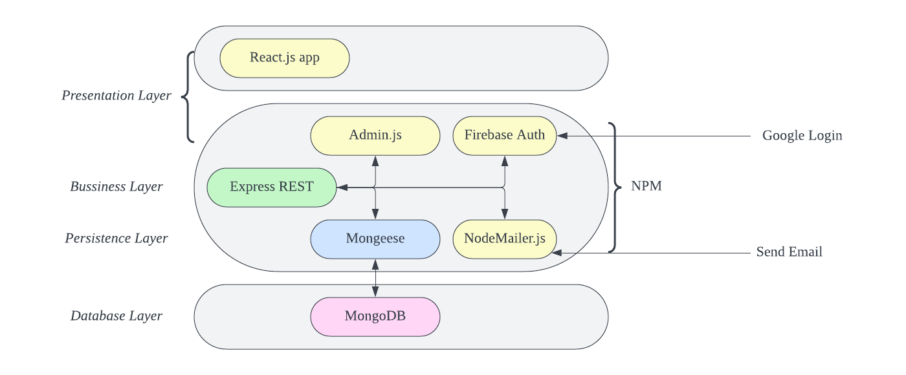

# Software Design
This page includes a short description of the overall architecture style of the system, its high-level system components, and their logical (what data they exchange) and control (how they invoke each other) dependencies. Mostly described using diagrams.

## Architecture Diagram
The React-Express Stack is used for the development of the application. The database used is MongoDB, and persistence with Express by using Mongeese. Admin.js is used for building the admin panel. Firebase Auth is used for authentication, email verification will use npm email verification library.

## Low-Fidelity User interface
